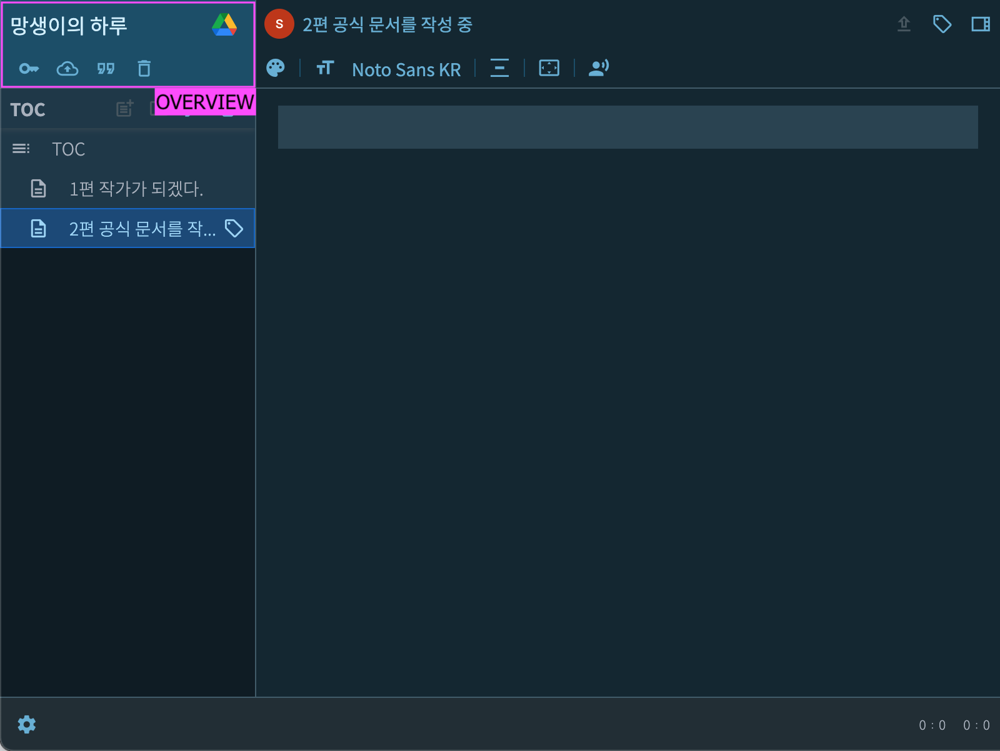

# Overview
{: .no_toc }

이곳에서는 전체 작품에 관련된 설정 기능을 제공합니다.
{: .fs-6 .fw-300 }

* 책 암호화 - 집필중인 책에 암호를 설정해서 안전하게 보관합니다.
* 백업 및 자동 저장 - 구글 드라이브로 백업을 업로드할 수 있습니다. 편집을 멈출때 자동 저장 기능을 사용합니다.
* 출판 앙식 - 편집 중인 글의 글자수 및 출판 시 부호 치환 규칙을 지정합니다.
* 휴지통 - 삭제한 노트를 확인할 수 있는 곳.

{: width="800" }