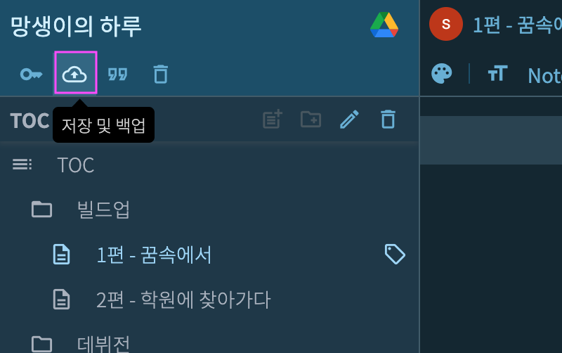

# 저장 및 백업

이 메뉴에서는 자동 저장 및 작업중인 문서를 구글 드라이브에 업로드하는 기능을 제공합니다.

***저장 및 백업*** 버튼을 클릭합니다.

{: width="400" }

아래와 같이 설정 화면이 나타납니다.

## 자동 저장

{: width="450" }

위와같이 입력하면 마지막 키보드 입력 후 3초가 지나면 자동으로 문서를 SSDA 편집기 서버에 저장합니다.

* 최소 3초, 최대 30초로 지정 가능합니다.
* 사용하지 않을때는 체크박스를 해제합니다.

## 자동 백업

문서를 저장할때 복제본을 구글 드라이브로 업로드할 수 있습니다.

아래 화면은 자동 백업을 활성화하기 전의 모습입니다.

{: width="450" }

***연결*** 또는 아이콘을 클릭하면 다음과 같은 화면이 나타납니다.

{: width="450" }

* Dropbox는 아직 지원하지 않습니다.

위 화면에서 구글 드라이브 아이콘을 누르면 로그인 과정과 비슷한 화면이 나타납니다. 다음과 같이 백업용으로 사용할 구글 드라이브 계정을 선택합니다.

{: width="800" }

계정을 선택하면 다음과 같은 화면이 나타납니다.

{: width="800" }

* SSDA 편집기가 파일을 업로드할 권한이 없는 상태

SSDA편집기가 선택한 구글 드라이브에 노트 복제본을 업로드하려면 두가지 권한이 필요합니다.

1. 폴더나 파일을 생성할 수 있는 권한
2. 설정 파일을 생성, 삭제할 수 있는 권한

이 권한들은 여러분이 구글 드라이브에 갖고 있는 다른 파일들에는 접근할 수 없습니다. SSDA 편집기를 통해서 생성하고 업로드한 폴더 및 파일들만 화면에 보이고 접근할 수 있습니다.

위 화면에서 ***권한 요청*** 버튼을 클릭하면 아래와 같은 권한 승인 화면이 나타납니다.

{: width="800" }

권한 두 개를 승인하면 아래와 같이 화면이 변경됩니다.

{: width="800" }

이제 백업 파일을 업로드할 폴더가 필요합니다.

위 화면에서 ***새로 생성*** 버튼을 클릭해서 폴더 이름을 입력합니다.

{: width="800" }

* 컴퓨터에서 폴더를 생성하듯이 원하는 이름을 입력합니다.

폴더를 생성한 후의 화면은 아래와 같습니다. 폴더 선택 아이콘을 클릭합니다.

{: width="800" }

다음 화면처럼 백업을 업로드할 폴더가 지정되었습니다.

{: width="800" }

이제 편집기에서 노트를 저장할때마다 노트 복제본을 지정한 폴더에 업로드합니다.

* 저장시마다 매번 그 시점의 노트를 복제합니다.
* 편집 작업을 끝낸 후 불필요한 파일은 구글 드라이브에서 삭제할 수 있습니다.

백업 기능이 활성화되면 아래와 같이 작품명 오른쪽의 구글 드라이브 아이콘이 나타납니다.

{: width="800" }

구글 드라이브 버튼을 누르면 백업된 노트들을 확인할 수 있습니다.

{: width="800" }

백업된 노트들은 구글 드라이브에서도 확인할 수 있습니다.

{: width="800" }
