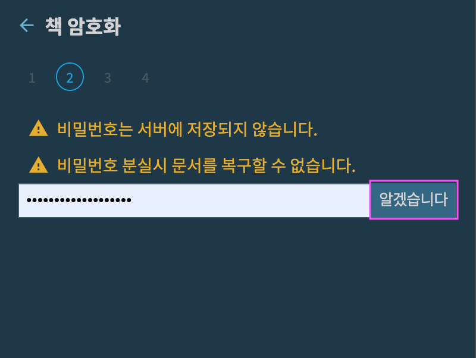

# 책 암호화

***책 암호화*** 버튼을 클릭합니다.

{: width="300" }

전체 책을 암호화할때 사용할 비밀 번호를 지정합니다.

{: width="400" }

* 8글자 이상
* 영문자, 숫자, 특수기호가 포함되어야 합니다.
* 입력한 비밀번호는 서버로 전송하지 않습니다.

***다음***을 누르면 두 번의 연습 화면으로 이동합니다. 

{: width="400" }

* 비밀번호를 반드시 기억하세요.
* 책이 암호호되면 편집을 시작할때 암호를 입력해야합니다.

{: width="400" }

{: width="400" }

세 번에 걸쳐 비밀번호를 올바로 입력하면 최종 화면이 나타납니다.

***암호화 시작***을 눌러서 기존에 작성한 노트들을 모두 암호화합니다.

{: width="400" }

아래는 노트 및 설정 정보에 대한 암호화가 완료된 후의 화면

{: width="400" }

이제부터 노트를 편집하거나 설정 정보를 추가, 편집할때마다 브라우저에서 암화화해서 SSDA 편집기 서버로 전송합니다.

이후에 편집 화면에 접속하면 아래와 같이 암호를 물어봅니다.

{: width="400" }

암호를 올바로 입력해서 편집을 시작합니다.