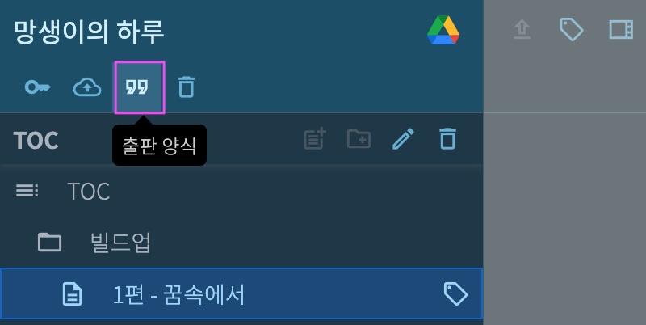
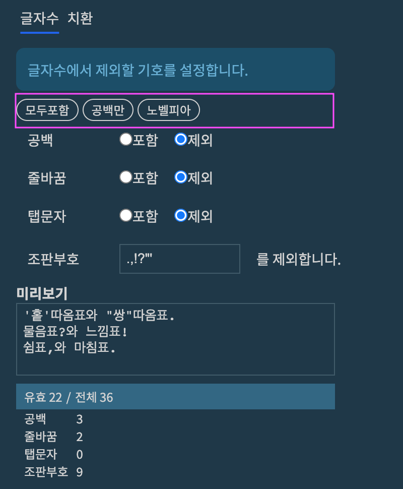
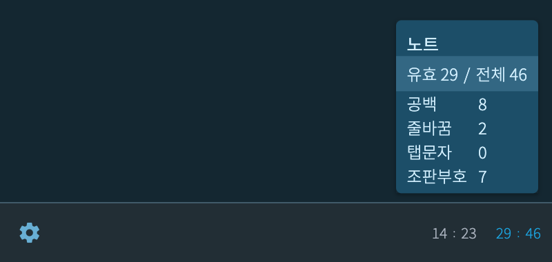
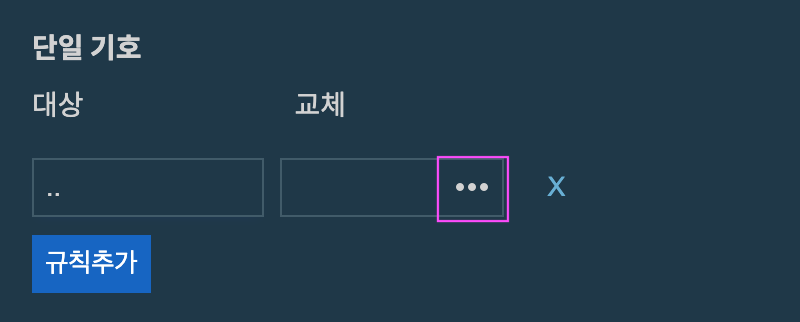
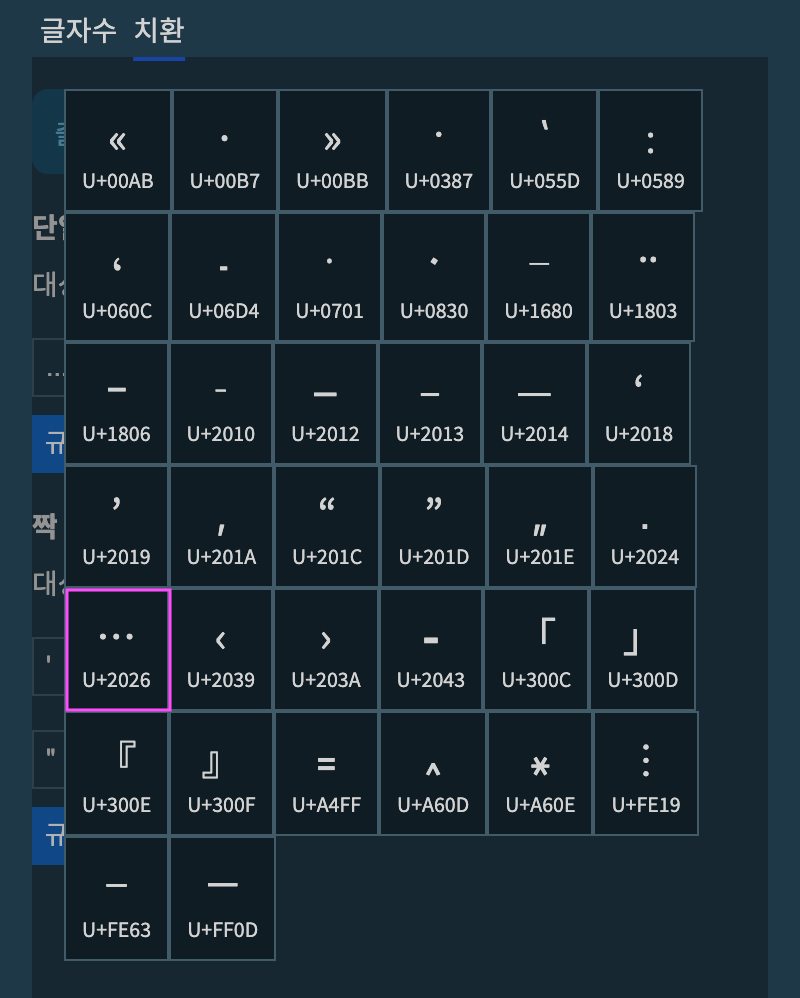
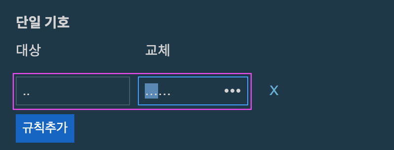
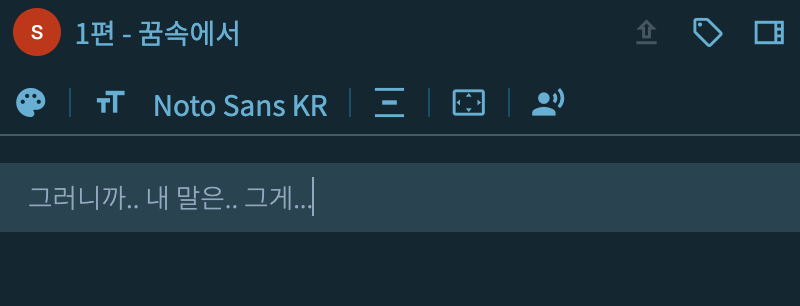
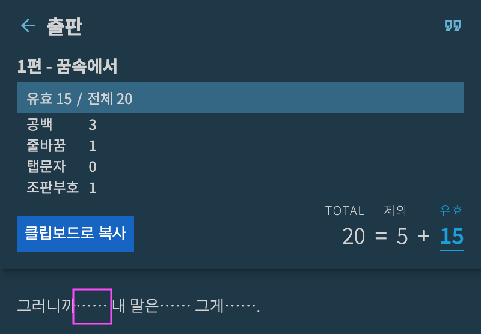

# 출판 양식

작품명 하단에서 ***출판 양식*** 버튼을 클릭합니다.

{: width="400" }

여기서는 두가지 설정 기능을 제공합니다.

* 글자수 - 집필 중인 노트의 글자수 규칙
* 치환 - 집필 후 출판 시 문장 부호 등을 교체

## 글자수

{: width="400" }

***글자수*** 탭을 누르면 아래와 같은 화면이 나타납니다.

{: width="400" }

* 모두포함 - 글자수에서 제외하는 글자가 없음
* 공백만 - 공백(space), 줄바꿈(Enter), 탭 등의 부호를 글자수에서 제외함. 기타 문장부호는 모두 글자수에 포함함
* 노벨피아 - 공백, 줄바꿈, 탭문자 및 노벨피아에서 지정한 문장부호들을 글자수에서 제외함.

> 노벨피아는 다른 플랫폼과 달리 마침표, 쉼표, 느낌표, 물음표, 홑따옴표, 쌍따옴표를 글자수에서 제외합니다.

**미리보기**에 문장을 입력하면 설정한 규칙에 따라 제외되는 글자수를 확인할 수 있습니다.

* `유효 22` - 전체 36글자 중 규칙에 따라 14글자(공백3 + 줄바꿈2 + 조판부호9)를 제외한 나머지 글자.

여기서 설정한 규칙은 편집중에 우측 하단의 노트의 글자수 정보에 적용됩니다.

{: width="400" }

## 치환

집필을 끝낸 후 출판 시 문장 부호를 치환하는 용도로 사용합니다.

### 단일 기호

예를 들어 집필 중에는 다음과 같이 마침표 2개로 말 줄임표를 나타내고

* 그러니까.. 내 말은.. 그게..\.

출판할때는 마침표 2개를 수평줄임표(Horizontal Ellipsis, `U+2026`) 2개로 교체하고 싶습니다.

* 그러니까…… 내 말은…… 그게…….

단일 기호 메뉴에서 아래와 같이 **대상** 기호에 마침표 두 개를 입력합니다.

{: width="400" }

이제 마침표 2개를 교체할 기호를 지정합니다.

아래 화면에서 ***교체*** 컬럼의 버튼을 누릅니다.

{: width="400" }

원하는 기호를 선택합니다.

여기서는 수평줄임표(Horizontal Ellipsis, `U+2026`)를 선택합니다.

{: width="400" }

위의 과정을 한 번 더 진행해서 다음과 같이 2개의 마침표를 2개의 말줄임표로 치환하는 규칙을 생성했습니다.

{: width="400" }

편집기에 다음과 같이 문장을 입력합니다.

{: width="600" }

편집기 하단에 톱니 모양의 버튼을 눌러 설정 메뉴를 열어줍니다.

{: width="400" }

위 화면에서 ***노트 출판***을 누르면 치환 규칙이 적용된 출판용 노트가 출력됩니다. 클립보드로 복사해서 원하는 곳에 붙여넣습니다.

{: width="400" }

>기본 규칙으로 마침표 3개를 수평줄임표(Horizontal Ellipsis, `U+2026`) 2개로 교체하는 단일 기호 규칙이 존재합니다. 입맛에 맞게 고쳐쓰거나 규칙을 삭제해도 됩니다.{: info}

### 짝 기호

마찬가지로 홑따옴표나 쌍따옴표를 특정 기호로 치환할 수 있습니다.

