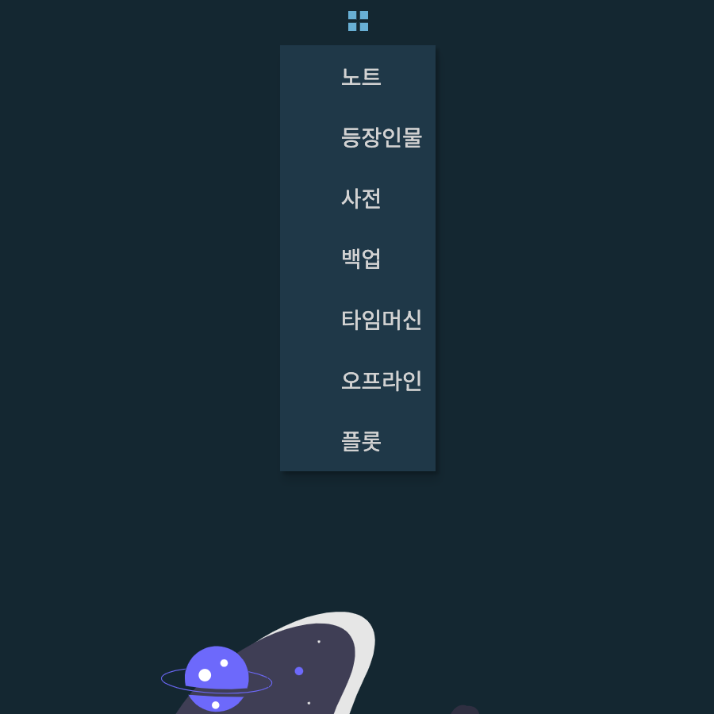

# Plugins
{: .no_toc }

이곳에서는 작품 내용을 살펴볼 수 있는 다양한 플러그인에 대해 설명합니다.
{: .fs-6 .fw-300 }

편집기 우측 상단의 `플러그인`을 클릭하면 다음과 같은 창이 나타닙니다.

{: width="450" }

* 노트 - 현재 편집 중인 노트의 요약 정보를 보여줍니다.
* 등장인물 - 현재 편집중인 노트에서 등장인물 정보를 확인합니다.
* 사전 - 국어사전 기능을 제공합니다.
* 백업 - 노트를 안전하게 저장할 수 있습니다.
* [타임머신](/docs/plugins/timemachine) - 노트 편집 시 ***스냅샷을 자동 저장***합니다. 언제든지 과거의 문서 이력을 확인할 수 있습니다.
* 오프라인 - SSDA 소설 저작 도구에서는 인터넷 연결이 없는 곳에서 노트를 편집할 수 있습니다. 이곳에서 오프라인 작업을 확인할 수 있습니다. 인터넷이 다시 연결되면 오프라인 작업 내역을 전송합니다.
* 플롯 - 이곳에서 사건과 플롯 목록을 확인할 수 있습니다.
