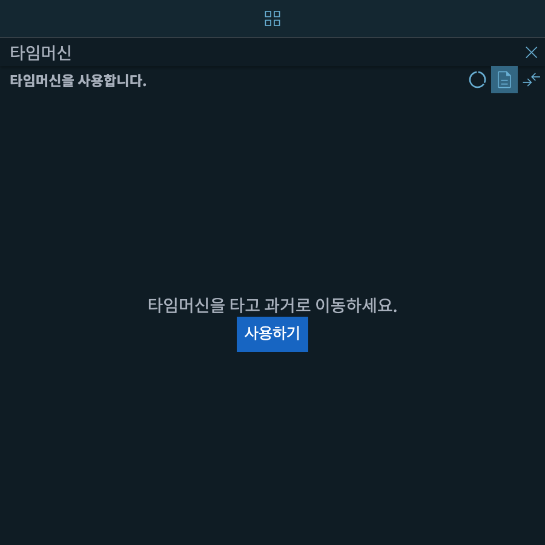
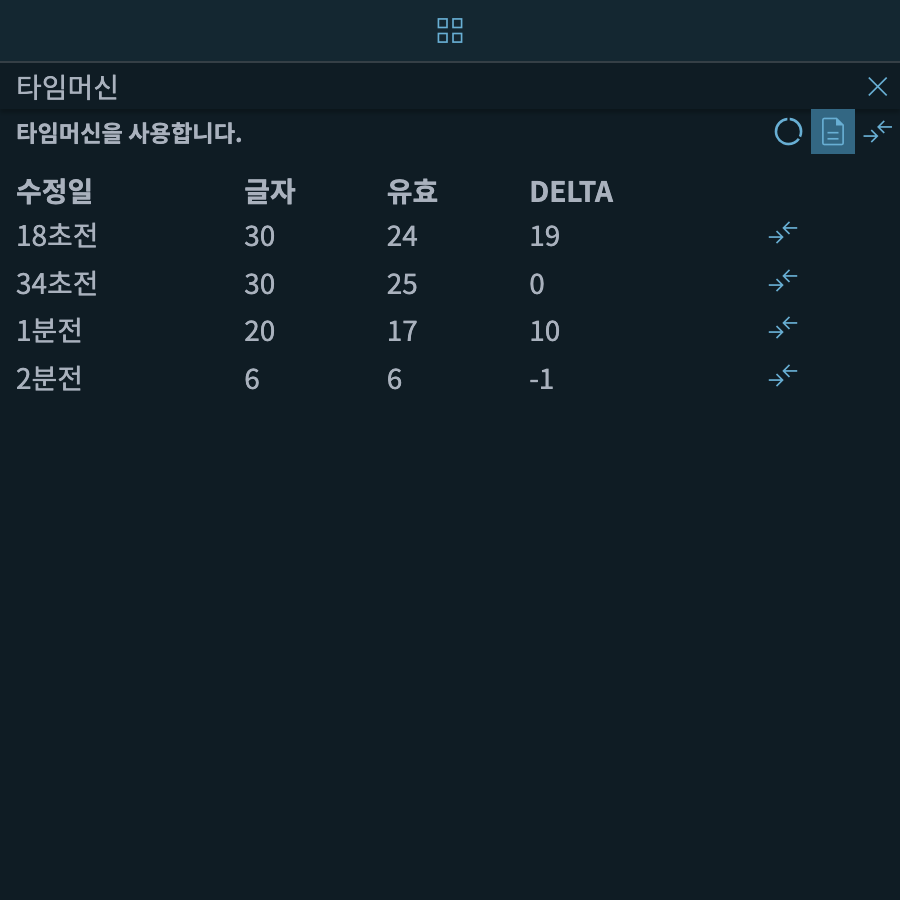
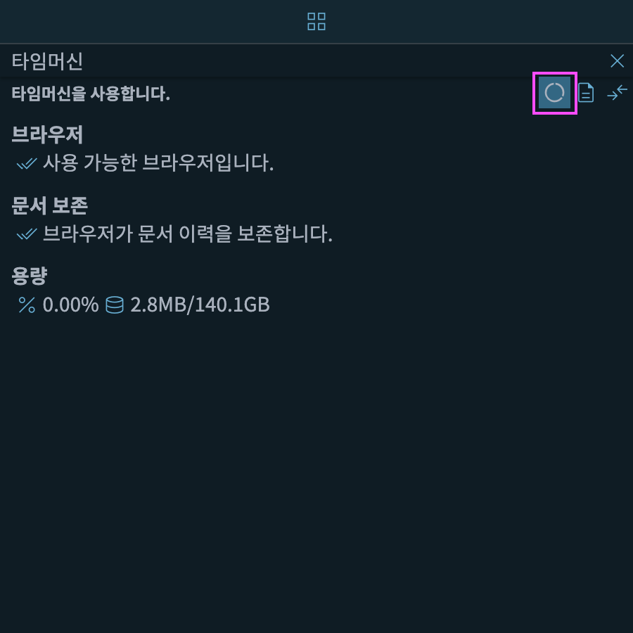
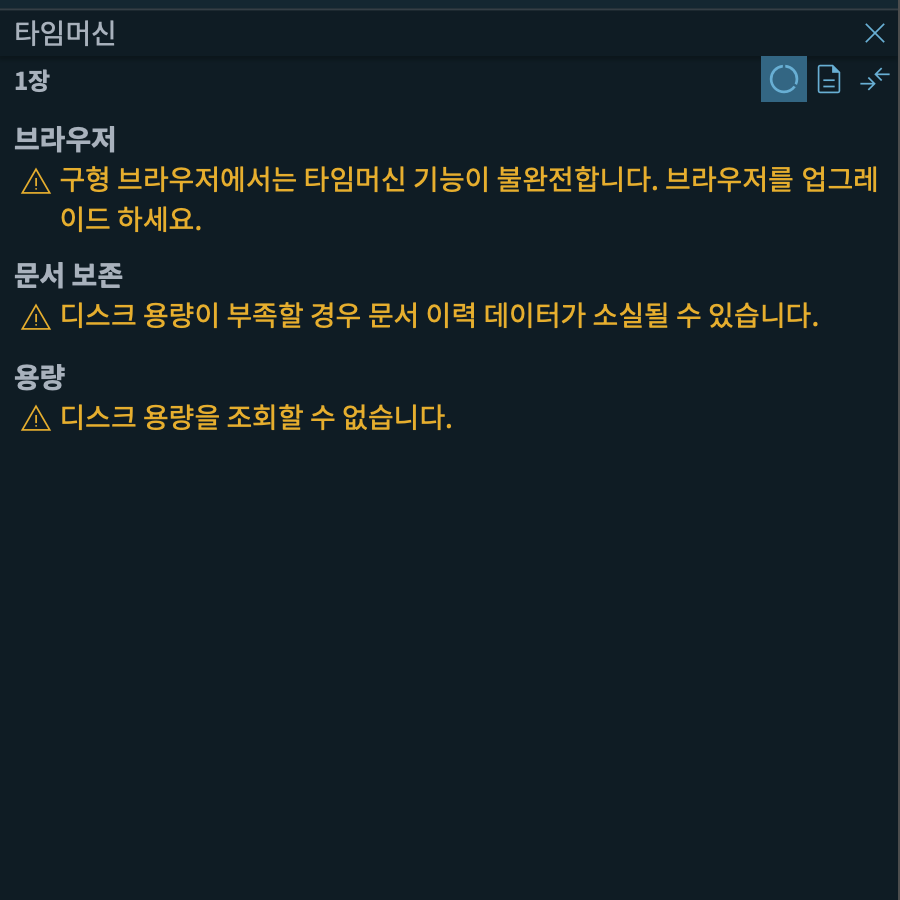
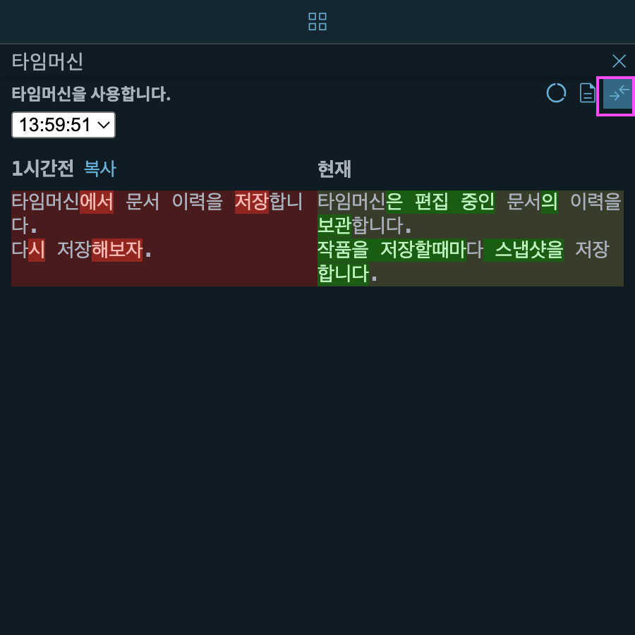

# 타임머신

편집 중인 노트의 이력을 생성, 보관합니다.

{: width="450" }

***사용하기*** 버튼을 누르면 다음과 같이 작품 이력을 저장할 수 있는 화면으로 전환합니다.

아래와 같이 현재 편집 중인 노트의 이력을 보여주는 화면이 나타납니다.

{: width="450" }

* 수정일 - 노트가 수정된 시간
* 글자 - 공백, 기호 등을 포함한 모든 글자 수
* 유효 - [출판양식](https://doc.ssda.app/docs/overview/publication) 에서 지정한 규칙을 적용한 글자수
* DELTA - 노트를 저장할때 글자수의 증감을 나타냅니다.

## 디스크 용량

***디스크 용량*** 버튼을 누르면 아래와 같이 타임머신 기능 지원 여부와 이용 가능한 용량을 확인할 수 있습니다.

{: width="450" }

SSDA의 타임머신은 브라우저에서 제공하는 데이터베이스를 사용해서 노트 이력을 관리합니다.

최신 브라우저들은 데이터베이스 기능을 지원하지만 일부 구형 브라우저는 타임머신 기능이 올바로 작동하지 않거나 저장된 문서 이력이 삭제될 수도 있습니다.

> 크롬 브라우저(Chrome Browser) 사용을 적극 권장합니다.

아래는 **구형 브라우저**에서 조회한 화면입니다.

{: width="450" }

* 브라우저 - 구형 브라우저에서 필요한 기능을 지원하지는지 나타냅니다.
* 문서보존 - 디스크 용량이 부족할 경우 브라우저가 강제로 데이터베이스의 일부 내용을 삭제할 수  있습니다. 삭제 방지 기능이 활성화되었는지 나타냅니다.
* 용량 - 브라우저가 저장할 수  있는 디스크 용량을 나타냅니다. 일부 구형 브라우저에서는 이 기능을 제공하지 않을 수도 있습니다.

## 노트 비교

가장 오른쪽의 ***노트비교*** 버튼을 누르면 아래와 같이 노트의 변경 이력을 구체적으로 보여줍니다.

{: width="450" }

* 왼쪽 - 문서 수정 후 저장하기 직전의 노트 내용(스냅샷)이 나옵니다.
* 오른쪽 - 현재 편집 중인 노트의 내용이 나옵니다.

왼쪽의 빨간색은 현재 문서에서 삭제된 내용을 보여줍니다.

오른쪽의 녹색은 왼쪽 문서에서 추가된 내용을 보여줍니다.

## 꼭 알아두세요

1. ***디스크 용량*** 에서 문서 보존 기능이 활성화되었는지 확인합니다. 디스크용량이 부족할 경우 공간 확보를 위해서 브라우저가 노트 이력을 삭제할 수 있습니다.
1. 문서이력은 브라우저 안에서만 보관됩니다. SSDA 서버에 저장되지 **않습니다**.
1. 하나의 문서를 모바일 기기와 PC에서 번갈아 문서를 편집하는 경우 문서 이력은 기기간에 공유되지 않습니다.