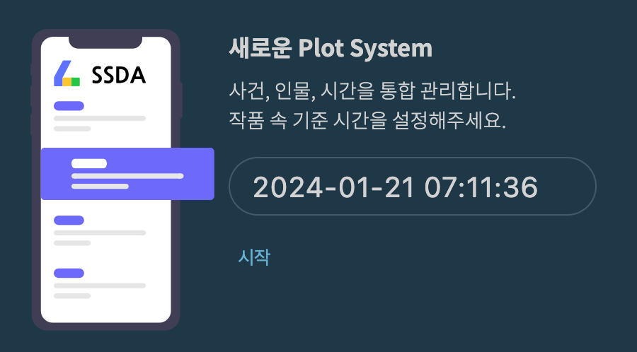
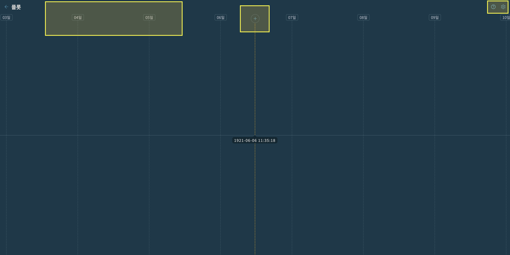
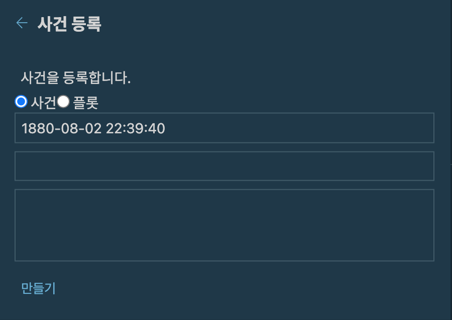
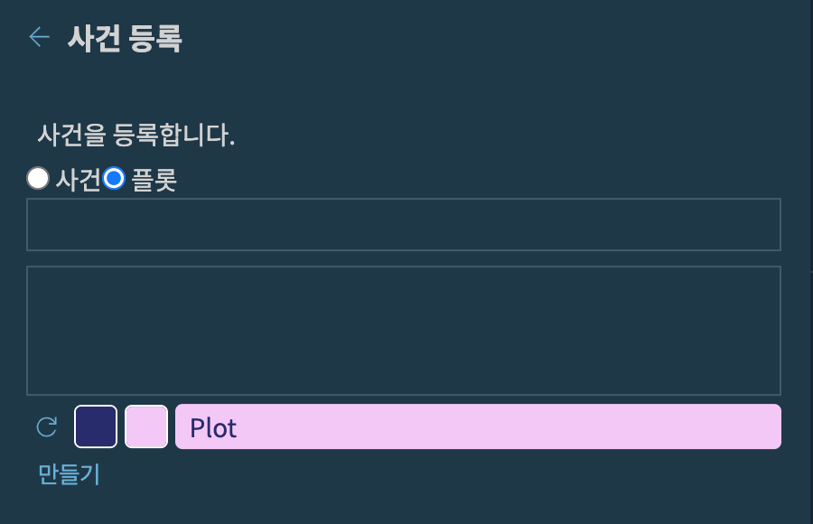
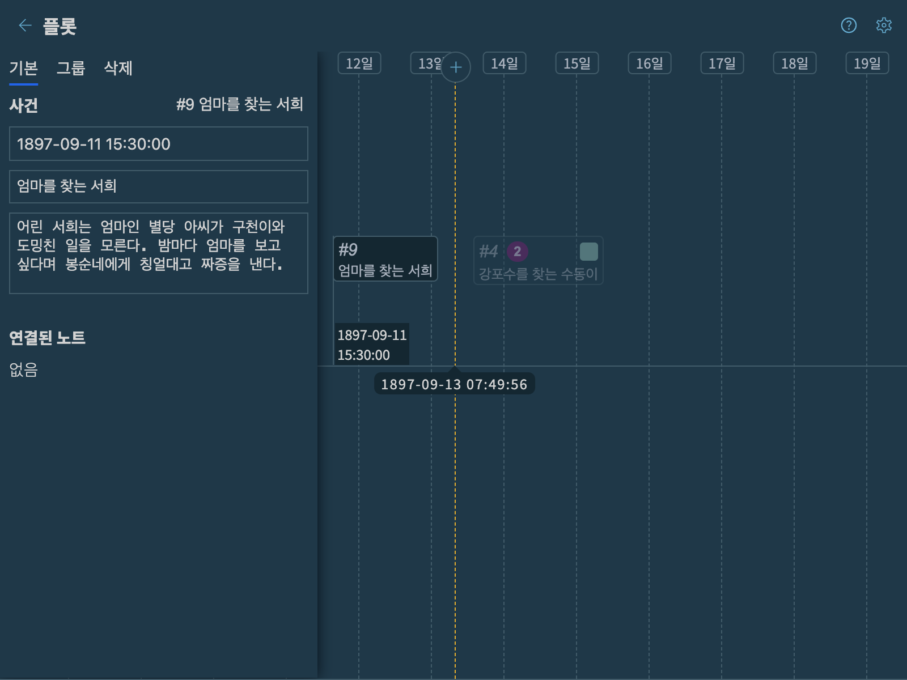
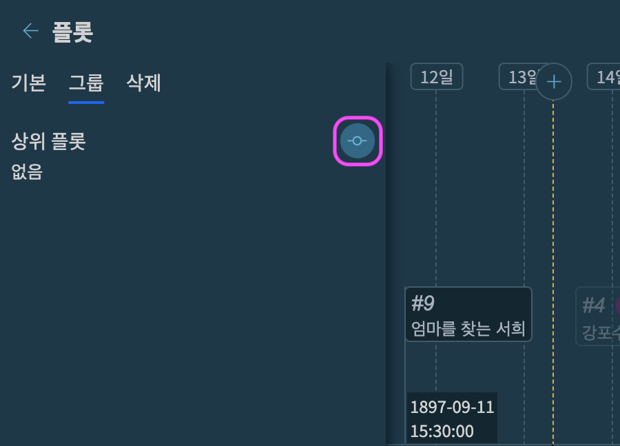
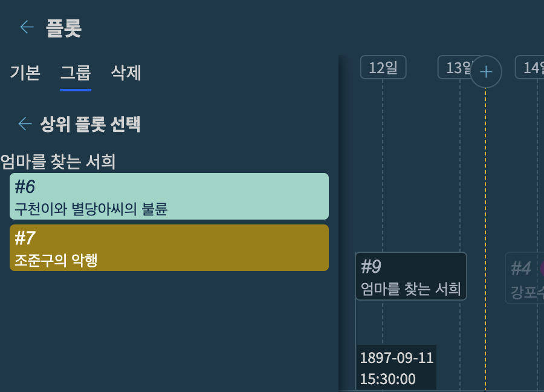
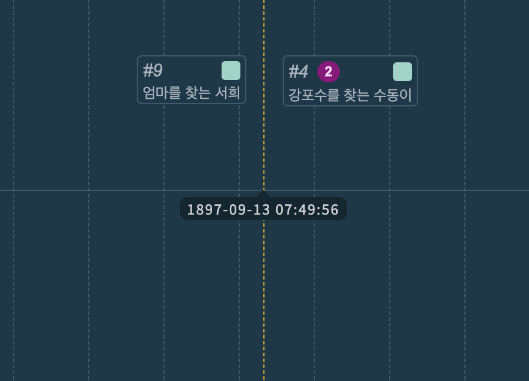

# 5. Plot System 플롯 시스템

여기서는 작품 설정 정리에 대해 설명합니다.

## 5.1. [설정] 플롯 열기

편집기 좌측 하단에서 `[설정] 플롯`을 클릭합니다.

{: width="450" }

### 5.1.1. Fiction Time(기준 시간) 설정

플롯 시스템 도입 이전에 만든 작품이 있다면 다음과 같이 작품 속 기준 시간을 설정하는 화면이 나타납니다.

> 현재는 새로운 책을 만들 때 Fiction time을 입력받기 때문에 아래의 화면이 나오지 않습니다.

{: width="450" }

플롯 설정 화면에서 소설 속 사건을 생성할 때 기준이 되는 시간입니다. 이야기의 배경이 되는 적당한 날짜를 선택합니다.
먼 미래의 이야기나 판타지처럼 현실 시간과 다른 경우에도 임의의 시간을 선택해주세요.

### 5.1.2. 플롯 설정 화면

이제 다음과 같은 타임라인 화면이 나타납니다.

{: width="1200" }

* 해상도 - 작은 해상도부터(년도, year) 큰 해상도까지(시간, hour) 시간축의 범위를 변경할 수 있습니다.
* 플롯 및 사건 생성 - 화면 속 기준 시간에 새로운 사건을 생성합니다.
* 설정 및 도움말 - 간단한 도움말과 플롯 화면 설정 메뉴를 제공합니다.

## 5.2. 화면 조작
해상도 변경, 시간 축 이동, 사건(플롯) 등록에 대해서 다룹니다.

### 5.2.1. 해상도 변경

> SHIFT + 아무스 휠
> 또는
> SHIFT + 트랙패드

플롯 및 사건들이 특정 시간대에 조밀하게 뭉쳐있거나 긴 시간에 걸쳐서 전개되는 경우 시간 해상도를 변경해서 이야기 구조를 파악합니다.

* 해상도 증가 - 넓은 시간대에서 좁은 시간대로 변경하려면 `shift + 위로스크롤` 또는 트랙패드에서는 `shift + 위로 쓸어올리기`를 합니다. `연도 > 월 > 일 > 시간` 으로 해상도가 증가합니다.
* 해상도 감소 - 좁은 시간대에서 넓은 시간대로 변경하려면 `shift + 아래로스크롤` 또는 트랙패드에서는 `shift + 아래로 쓸어올리기`를 합니다. `시간 > 일 > 월 > 연도` 로 해상도가 감소합니다.

### 5.2.2. 시간축 이동

마우스로 스크롤하며 시간축을 전후로 이동시킵니다.(트랙패드에서도 동일)

### 5.2.3. 플롯 및 사건 생성

가운데 시간축 상단의 `(+)` 버튼을 클릭합니다.

{: width="450" }

위와 같이 사건 또는 플롯을 생성하는 화면이 나옵니다.

## 5.3. 플롯 vs 사건

사건은 이야기의 최소 단위이고, 플롯은 그러한 사건들의 집합입니다.

### 5.3.1. 사건
사건은 ***특정 장소*** 에서 ***특정 시간*** 에 ***특정 인물들***이 얽혀서 빚어내는 이야기 조각입니다.

* 발생 시점을 특정할 수 있음.
* 비교적 짧은 시간 내에 완결됨.
* 예시) 제주도에서 결혼식을 올림, 버스에서 가방을 두고 내렸음, 약속 시간에 또 늦음, 자동차 사고가 났음.

### 5.3.2. 플롯

{: width="450" }

사건의 모음인 플롯은 다음과 같이 사용할 수 있습니다.

1. ***응집성 있는*** 사건들의 모음
1. ***동일한 맥락***의 사건들을 수집하는 용도

예를 들어서 **파탄난 결혼 생활**이라는 플롯을 생각해봅시다.

남주에게 배신당한 여주가 남주의 결혼을 망차기 위해서 벌이는 일련의 사건들이 존재합니다. 이렇게 플롯은 적당한 호흡으로 진행되는 이야기 속 단위 사건들을 모아둔 바구니와 같습니다.

**동앨한 맥락**의 전형적인 사례는 ***출생 및 사망***과 같은 단발성 사건들입니다.

* 등장 인물들의 출생 및 사망을 모아서 파악하고 싶음
* 특정 장소에서 벌어진 전투 시점과 결과를 모아서 파악하고 싶음
* 등장 인물의 동선을 모아서 살펴봄

이렇게 응집성 있는 스토리는 아니지만 특정 맥락의 사건들을 수집해서 정리함으로써 설정 구멍을 회피할 수 있습니다.

### 5.3.3. 플롯의 UI적 특징

플롯이 사건과 구별되는 특정들입니다.

1. 배경색과 글자색 - 화면상에서 일반 사건과 플롯을 구별합니다.
1. 시간 범위 존재 - 플롯은 하위 사건들을 통해서 **시간 범위** 가 결정됩니다. 하나의 플롯에 속한 사건들 중 시간순으로 가장 앞선 사건과 마지막 사건이 플롯의 시간 범위를 결정합니다.
1. 트리구조 - 플롯은 또다른 플롯을 포함할 수 있습니다. 매우 긴 흐름의 플롯을 구체적인 하위 플롯으로 나눠서 이야기를 구조화할 수 있습니다.

## 5.4. 사건 및 플롯 편집

화면에서 사건 노드를 선택하면 좌측에 편집 화면이 나타납니다.

{: width="800" }

탭메뉴를 클릭해서 사건(플롯)을 편집할 수 있습니다.

* 기본 - 사건 제목과 상세 내용
* 그룹 - 사건을 플롯에 등록합니다.
* 삭제 - 선택된 사건(플롯)을 삭제합니다.

### 5.4.1. 기본 정보 수정

사건 시간, 제목 및 상세 내용을 수정합니다.

사건과 노트 연결은 [plugin/플롯] 화면에서 진행할 수 있습니다.

### 5.4.2. 그룹

사건을 플롯에 등록하거나, 플롯을 플롯에 등록해서 이야기의 구조를 만들어 나갑니다.

아래 그림은 `사건번호 #9`인 일반 사건을 플롯에 등록하는 화면입니다.

{: width="450" }

`연결` 버튼을 누르면 다음과 같이 등록 가능한 플롯이 나타납니다.

{: width="450" }

`사건 #9`를 등록할 적절한 플롯을 클릭합니다.

`플롯 #6`을 클릭하면 다음과 같이 사건 노드가 변경됩니다.

{: width="450" }

* `사건 #4`와 `사건 #9` 는 동일한 플롯에 포함된 상태
* `사건 #9`는 두 개의 노트와 연결된 상태

> 모든 사건과 플롯들을 고유한 `#사건번호`를 자동으로 부여받습니다.

> 이 값들은 임의로 수정할 수 없으며 사건 또는 플롯을 삭제하면 해당 `#사건번호`도 사라집니다.

## 5.5. 노트와 연결

위와 같이 플롯과 사건을 정리한 후 실제 작품 단위인 노트와 연결합니다.
자세한 내용은 [플러그인/플롯]을 참고해주세요.
